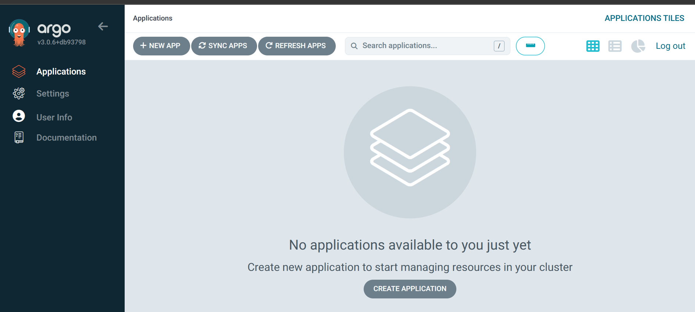
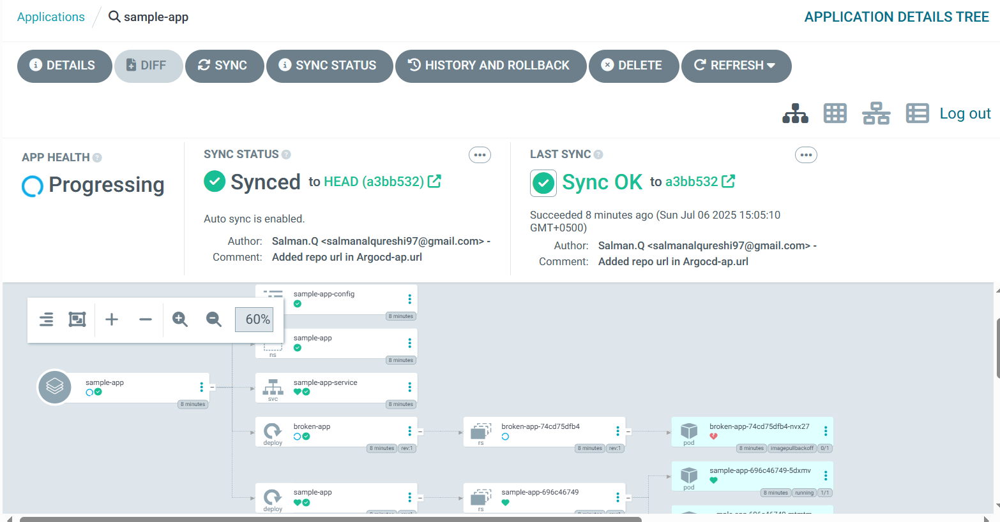
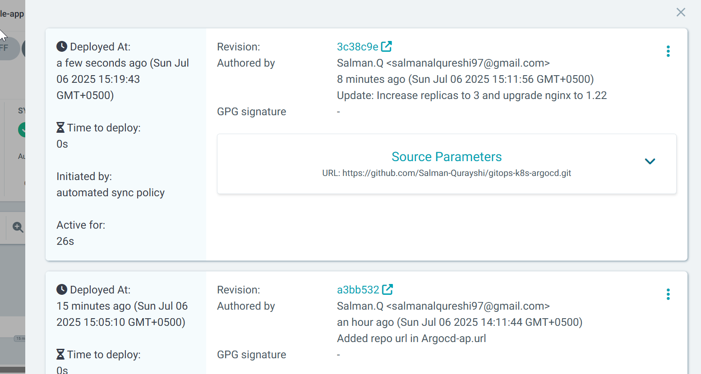

# GitOps with Kubernetes and ArgoCD

Hey there! So, this repository is basically my hands-on project where I explored GitOps principles using Kubernetes and ArgoCD. It was super cool to see how changes in my Git repo automatically reflected in my Kubernetes cluster.

Let me walk you through what I did in this project.

## Project Goal

My main goal here was to demonstrate the full GitOps workflow: defining my desired application state in Git, having ArgoCD continuously monitor that state, and then automatically synchronizing my Kubernetes cluster to match it. This covers everything from initial deployment to updates, handling errors, and performing rollbacks, all driven by Git commits

## My Setup

First off, I structured everything neatly in my local VS Code environment. All the Kubernetes manifest files, the ArgoCD application definition, and even some "broken" files for testing failures were set up in a clean directory.

My actual Kubernetes cluster ran on a **GCP (Google Cloud Platform) instance**. I had Minikube and Docker already set up there, but I made sure to give Minikube a fresh start to avoid any old project conflicts.

## Project Structure (What's in this Repo)

You'll find a pretty straightforward structure here:

-   `apps/sample-app/`: This is where all the Kubernetes manifests for my sample Nginx application live. You'll see `deployment.yaml`, `service.yaml`, `namespace.yaml`, plus a `configmap.yaml` and even a `broken-deployment.yaml` (more on that later!).
-   `argocd-app.yaml`: This crucial file tells ArgoCD *how* to find and deploy my application from this very repository.

## The Journey: What I Did Step-by-Step

### 1. Getting My Repository Ready

First, I created this repo locally and then pushed everything to GitHub. This repo became my "single source of truth."

```bash
# On my local machine (VS Code bash)
mkdir ~/gitops-k8s-argocd
cd ~/gitops-k8s-argocd
git init
git config user.name "Your Name" # I used my own name here
git config user.email "your.email@example.com" # And my email
# I created all the initial files: apps/sample-app/{deployment.yaml, service.yaml, namespace.yaml, configmap.yaml, broken-deployment.yaml} and argocd-app.yaml
git add .
git commit -m "Initial commit: Set up GitOps demo structure"
# Then, after creating an empty repo on GitHub:
git remote add origin [https://github.com/Salman-Qurayshi/gitops-k8s-argocd.git](https://github.com/Salman-Qurayshi/gitops-k8s-argocd.git)
git branch -M main
git push -u origin main
# Crucially, I then updated the argocd-app.yaml with the *actual* repo URL and pushed that change:
# (Opened argocd-app.yaml and changed 'YOUR_GITHUB_REPO_URL_HERE' to '[https://github.com/Salman-Qurayshi/gitops-k8s-argocd.git](https://github.com/Salman-Qurayshi/gitops-k8s-argocd.git)')
git add argocd-app.yaml
git commit -m "Update argocd-app.yaml with GitHub repo URL"
git push origin main

```

### 2. Setting Up Kubernetes and ArgoCD on GCP
Once my repo was good to go, I connected to my GCP instance and got Kubernetes ready.

```
# On my GCP instance terminal
# Cleaned up any old Minikube stuff:

minikube stop
minikube delete --all


# Cloned my repo onto the GCP instance:

cd ~
git clone [https://github.com/Salman-Qurayshi/gitops-k8s-argocd.git](https://github.com/Salman-Qurayshi/gitops-k8s-argocd.git)
cd gitops-k8s-argocd


# Started a fresh Minikube cluster:

minikube start --driver=docker --memory=4096 --cpus=2
kubectl cluster-info
kubectl get nodes


# Created the namespace for ArgoCD:

kubectl create namespace argocd
kubectl get namespaces
```

### 3. Installing and Accessing ArgoCD
Next up was getting ArgoCD itself running in my cluster.

```
# On my GCP instance terminal
# Installed ArgoCD manifests:

kubectl apply -n argocd -f [https://raw.githubusercontent.com/argoproj/argo-cd/stable/manifests/install.yaml](https://raw.githubusercontent.com/argoproj/argo-cd/stable/manifests/install.yaml)
kubectl wait --for=condition=available --timeout=300s deployment/argocd-server -n argocd
kubectl get pods -n argocd


# Got the admin password (copied this down carefully!):

kubectl -n argocd get secret argocd-initial-admin-secret -o jsonpath="{.data.password}" | base64 -d && echo


# Installed the ArgoCD CLI:

curl -sSL -o argocd-linux-amd64 [https://github.com/argoproj/argo-cd/releases/latest/download/argocd-linux-amd64](https://github.com/argoproj/argo-cd/releases/latest/download/argocd-linux-amd64)
sudo install -m 555 argocd-linux-amd64 /usr/local/bin/argocd
argocd version --client


# Logged into ArgoCD using the CLI:

argocd login localhost:8080 --username admin --password <MY_ARGO_PASSWORD> --insecure
argocd account get-user-info

# To access the UI from my local browser (this was a fun one to figure out!):
# 1. Killed any existing kubectl port-forward on GCP: kill <PID_OF_OLD_PORT_FORWARD>
# 2. Started a new port-forward binding to 0.0.0.0 on GCP:

kubectl port-forward --address 0.0.0.0 svc/argocd-server -n argocd 8080:443 &


# 3. Made sure GCP firewall allowed TCP 8080 ingress.
# 4. Then, I could go to https://YOUR_GCP_EXTERNAL_IP:8080 in my local browser and log in!
```

#### ArgoCD Web Interface
Here's a look at the ArgoCD web interface I accessed:



### 4. Deploying My Sample Application (The First Sync!)

This was the exciting part, seeing ArgoCD pull my app from Git!

```
# On my GCP instance terminal
# Applied the ArgoCD Application definition:

kubectl apply -f argocd-app.yaml


# Checked its status - it quickly went from Missing to Synced and Progressing:

argocd app list
argocd app get sample-app
argocd app status sample-app


# Verified the pods and service in Kubernetes:

kubectl get namespaces
kubectl get pods -n sample-app
kubectl get services -n sample-app
kubectl get deployments -n sample-app


# Tested the app (in a new terminal, forwarding app service port):

kubectl port-forward -n sample-app svc/sample-app-service 8081:80 &
curl http://localhost:8081 # Got the Nginx welcome page!
pkill -f "kubectl port-forward -n sample-app" # Cleaned up test port-forward
```

#### Application Details Tree
This shows the complete structure of my deployed application within ArgoCD:



### 5. Updating the Application (The Magic of GitOps!)
Now for the real GitOps test: I made changes in Git and watched them automatically deploy.

```
# On my local machine (VS Code bash)
# Changed replicas from 2 to 3 and Nginx image from 1.21 to 1.22 in apps/sample-app/deployment.yaml:

sed -i 's/replicas: 2/replicas: 3/' apps/sample-app/deployment.yaml
sed -i 's/nginx:1.21/nginx:1.22/' apps/sample-app/deployment.yaml
git add apps/sample-app/deployment.yaml
git commit -m "Update: Increase replicas to 3 and upgrade nginx to 1.22"
git push origin main
```

```
# On my GCP instance terminal (observing the sync)
# ArgoCD detected the change, went OutOfSync, then Progressing, then back to Synced/Healthy!

watch -n 2 'argocd app get sample-app | grep -E "(Health|Sync)"'


# Confirmed 3 pods and nginx:1.22 image:

kubectl get pods -n sample-app -l app=sample-app -o wide
kubectl describe deployment sample-app -n sample-app | grep -E "(Replicas|Image)"
kubectl get deployment sample-app -n sample-app -o jsonpath='{.spec.template.spec.containers[0].image}' && echo


# Checked history (cool to see the updates recorded!):

argocd app history sample-app
argocd app get sample-app --show-operation
```


### 6. Adding a ConfigMap and Customizing the App
I took it a step further by using a ConfigMap to serve custom HTML.

```
# On my local machine (VS Code bash)
# Modified apps/sample-app/deployment.yaml to mount the existing configmap.yaml as index.html
# (Used a big 'cat' command to overwrite deployment.yaml, adding volume mounts and volumes)

git add . # Added the modified deployment.yaml
git commit -m "Add ConfigMap and update deployment to use custom index.html"
git push origin main
```

```
# On my GCP instance terminal (observing the sync)
# Again, ArgoCD picked it up, synced it, and the app was healthy.
watch -n 2 'argocd app get sample-app | grep -E "(Health|Sync)"'


# Verified the ConfigMap mount in the deployment description:
kubectl describe deployment sample-app -n sample-app | grep -E "Volume Mounts:|Volumes:|config-volume" -A 5

# Re-tested the app, and BOOM! I saw my custom "Welcome to GitOps Demo!" HTML.
kubectl port-forward -n sample-app svc/sample-app-service 8081:80 &
curl http://localhost:8081 # Confirmed custom HTML!
pkill -f "kubectl port-forward -n sample-app"
```


### 7. Handling a Failed Deployment (Oops, I Broke It!)
I intentionally introduced a bad deployment to see how ArgoCD handles errors.

```
# On my local machine (VS Code bash)
# Changed argocd-app.yaml to point to the 'broken-deployment.yaml' path:

sed -i 's|path: apps/sample-app|path: apps/sample-app/broken-deployment.yaml|' argocd-app.yaml
git add argocd-app.yaml
git commit -m "Introduce a broken deployment to demonstrate failure handling"
git push origin main
```

```
# On my GCP instance terminal (observing the failure)
# ArgoCD quickly went Degraded, and the pods were stuck in ImagePullBackOff.

watch -n 2 'argocd app get sample-app | grep -E "(Health|Sync)"'
argocd app get sample-app # Saw the Degraded status and details
kubectl get pods -n sample-app # Confirmed ImagePullBackOff
kubectl describe deployment broken-app -n sample-app # Showed events with image pull errors
```


### 8. Rectifying the Failure (GitOps Rollback!)
The best part – fixing the problem by just changing Git back!

```
# On my local machine (VS Code bash)
# Reverted argocd-app.yaml back to the working path 'apps/sample-app':

sed -i 's|path: apps/sample-app/broken-deployment.yaml|path: apps/sample-app|' argocd-app.yaml
git add argocd-app.yaml
git commit -m "Revert: Point ArgoCD application back to the working sample-app path"
git push origin main
```


```
# On my GCP instance terminal (observing the self-healing)
# ArgoCD went from Degraded to OutOfSync, then Progressing, and finally back to Synced/Healthy!
watch -n 2 'argocd app get sample-app | grep -E "(Health|Sync)"'
argocd app get sample-app # Confirmed healthy status

# Verified that my original app was back and the broken one was gone:
kubectl get pods -n sample-app
kubectl get deployments -n sample-app

# Re-tested the app again – everything was working perfectly with my custom HTML!
kubectl port-forward -n sample-app svc/sample-app-service 8081:80 &
curl http://localhost:8081
pkill -f "kubectl port-forward -n sample-app"
```

#### History and Rollback
This screenshot shows ArgoCD's detailed history, allowing for easy rollbacks to previous stable states:



### Cleaning Up
After all that fun, I made sure to clean up my GCP instance.

```
# On my GCP instance terminal
# Deleted the ArgoCD application (which cleaned up my sample-app resources):
argocd app delete sample-app --cascade=true
# Deleted the namespaces:
kubectl delete namespace sample-app
kubectl delete namespace argocd
# Stopped and deleted Minikube:
minikube stop
minikube delete --all
# Made sure all port-forwarding processes were killed:
pkill -f "kubectl port-forward"
```
### Conclusion
This project was a fantastic deep dive into GitOps. It really showed me the power of defining my infrastructure and applications as code in Git, and having a tool like ArgoCD keep everything in sync automatically. It's a much more robust and transparent way to manage deployments.

